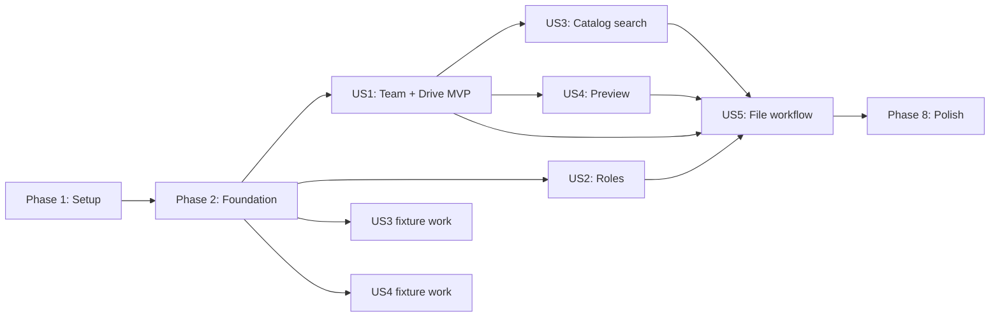

# Tasks: Командний медіапростір Soty

**Input**: Design documents from `/specs/001-team-media-workspace/`

**Prerequisites**: `plan.md`, `spec.md`, `research.md`, `data-model.md`, `contracts/`,
`quickstart.md`, and `.specify/memory/constitution.md`

**Tests**: Required for this feature. The specification defines independent tests and
acceptance scenarios, and `quickstart.md` names the automated suites. For each story, write
the listed tests first and confirm that they fail for the intended missing behavior before
implementation.

**Organization**: Tasks are grouped by user story. Shared schema, typed contracts, security
helpers, and boundary adapters are foundational because every story depends on them.

## Format: `[ID] [P?] [Story] Description`

- **[P]**: May run in parallel after its phase prerequisites because it changes different
  files and has no dependency on an unfinished task in the same parallel batch.
- **[Story]**: Maps the task to User Story 1–5 from `spec.md`.
- Every task names the exact file or files it must create or modify.

## Phase 1: Setup (Shared Infrastructure)

**Purpose**: Make the existing monorepo and local Supabase stack ready for the team feature
without changing release identity or deploying production resources.

- [x] T001 Pin the current resolved React, React DOM, Vite, plugin, and React type versions instead of `latest` in `apps/web/package.json` and refresh `package-lock.json`
- [x] T002 [P] Scaffold shared team barrels in `packages/shared/src/team/index.ts`, web feature exports in `apps/web/src/team/index.ts`, and agent bridge exports in `apps/agent/src/team-bridge/index.ts`
- [x] T003 [P] Set PostgreSQL 17 and explicit JWT modes for `drive-oauth-callback` and `catalog-sync` in `supabase/config.toml`
- [x] T004 [P] Add exact `"generate:team-contract": "npm run build -w @video-compressor/shared && node scripts/generate-team-contract-sql.mjs"` plus shared-rebuilding `--check`/`test:team` consumers to `package.json`
- [x] T005 [P] Add fail-closed `DRIVE_OAUTH_MODE=disabled` plus Google, Resend, canonical-site, and catalog-worker examples to `supabase/functions/.env.example`, document local override `testing`, and keep `supabase/functions/.env.local` ignored in `.gitignore`

**Checkpoint**: Dependency versions are reproducible, the planned module paths exist, and
the local stack can be configured without committing a secret.

---

## Phase 2: Foundational (Blocking Prerequisites)

**Purpose**: Establish the shared contract, database authority, security boundary, and
typed client seams that block every user story.

**⚠️ CRITICAL**: No user-story implementation begins until this phase passes its contract
and database security tests.

### Tests for the foundation

- [x] T006 [P] Write failing shared/SQL parity and boundary tests for roles, permissions, OAuth modes/errors, classifier/editor/transcript rules, invite/member/transfer limits, vocabularies, payload guards, `teamWorkspace` compatibility, and a `mkdtemp` stale-`dist` process fixture proving `generate:team-contract -- --check` rebuilds before drift detection in `tests/team-contract.test.ts`
- [x] T007 [P] Create failing pgTAP coverage that inventories every feature function for `prosecdef=true`, empty `search_path`, exact EXECUTE ACL, fully-qualified behavior, null/spoofed/inactive/foreign-team denial, search-path shadow resistance, base table RLS, private-schema isolation, unknown permissions, and safe Realtime publication in `supabase/tests/database/team-workspace.test.sql`

### Shared contracts and generated SQL

- [x] T008 [P] Implement canonical roles, independent `edit`/`manage_metadata` permissions, states, OAuth mode parser, limits, GEO/language vocabularies, normalization, unknown-input validators, MIME/extension/package classifier, and bounded UTF-8/SRT/VTT extractor rules in `packages/shared/src/team/contract.ts`, `packages/shared/src/team/material-category.ts`, and `packages/shared/src/team/transcript.ts`
- [x] T009 [P] Implement discriminated RPC, structured Edge error, Drive transfer, operation, transcript state, TXT edit, separate-version, preview, and agent payload contracts in `packages/shared/src/team/transport.ts`
- [x] T010 [P] Implement content-free typed onboarding/find/preview/file/workflow/workspace/discovery/production analytics contracts with opaque attempt ids, durations, categories/buckets/outcomes, and forbidden-field guards for SC-001 and SC-005–SC-009 in `packages/shared/src/team/analytics.ts`
- [x] T011 Re-export the complete team contract through `packages/shared/src/team/index.ts` and the package root `packages/shared/src/types.ts`
- [x] T012 [P] Add the `teamWorkspace` tool contract and web compatibility requirement without changing product version or `AGENT_API_VERSION` unnecessarily in `packages/shared/src/release.ts`
- [x] T013 Implement deterministic `--check`/write shared-contract-to-SQL generation that consumes freshly built shared output and exposes drift without rewriting in `scripts/generate-team-contract-sql.mjs`
- [x] T014 Generate role defaults, permission flags, OAuth/error settings, classifier/editor/transcript limits, ISO GEO rows, and BCP 47 language rows in `supabase/migrations/20260801090000_team_contract_seed.sql`

### Database authority and security

- [x] T015 Create teams, active/history-aware memberships, invitations, canonical owner invariant, invite dedupe, capacity-supporting indexes, and `citext` support in `supabase/migrations/20260801091000_teams_members_invitations.sql`
- [x] T016 Create private Google credentials/OAuth transactions, Drive connections, versioned classification fields, bounded transcript ingest/source states, material catalog/metadata/search/tombstones, and acyclic `processed_from|version_of` provenance links in `supabase/migrations/20260801092000_drive_vault_catalog.sql`
- [x] T017 Create idempotent operations, name reservations, private scoped transfer grants, durable sync jobs, and append-only audit events in `supabase/migrations/20260801093000_team_operations_audit.sql`
- [x] T018 Implement every foundation SQL function—including `private.team_role`, `private.effective_permissions`, `private.can`, owner triggers, Vault/grant/sync/transcript/audit helpers—as `security definer` with `search_path=''`, fully-qualified objects, caller/service checks, revoked default execute and narrow ACLs; add base RLS/grants and safe Realtime publication in `supabase/migrations/20260801094000_team_security_foundation.sql`
- [x] T019 Record exact reverse-order recovery guidance for all foundational migrations in `supabase/migrations/ROLLBACK.md`

### Boundary adapters

- [x] T020 [P] Implement shared CORS, unknown-input parsing, stable `{ ok:false,error:{code,retryable,details?} }` Edge mapping, safe logging/redaction, and JSON response helpers in `supabase/functions/_shared/cors.ts`, `supabase/functions/_shared/validation.ts`, and `supabase/functions/_shared/errors.ts`
- [x] T021 Implement user-JWT caller-scoped gates, one-time OAuth callback, named-secret worker auth, closed `DRIVE_OAUTH_MODE`, and any-production-signal detection via `SOTY_SITE_URL`, transaction/request origin, and shared `PRODUCTION_SITE_ORIGIN` in `supabase/functions/_shared/auth.ts`
- [x] T022 Implement service-only Vault credential access, mode-gated Google token refresh, provider validation, Shared Drive flags, live ancestry/per-item capability checks, and zero-side-effect `OAUTH_APPROVAL_REQUIRED` rejection in `supabase/functions/_shared/credentials.ts` and `supabase/functions/_shared/drive.ts`
- [x] T023 Implement idempotency, operation state, name reservation, transfer-grant hashing/consumption, and audit completion adapters in `supabase/functions/_shared/operations.ts`
- [x] T024 [P] Create only schema-independent Edge invocation, `unknown` response validation, and closed machine-error decoding in `apps/web/src/api/team.ts`; defer every generated-`Database` RPC signature until its story migration and type generation complete
- [x] T025 Implement the throwing active-team context, test override, active-team persistence, and effective-permission selectors in `apps/web/src/team/TeamContext.tsx`
- [x] T026 Implement RLS-filtered Postgres Changes subscription, reconnect refetch, and membership-loss teardown in `apps/web/src/team/useTeamRealtime.ts`
- [x] T027 Make the stale-`dist`, shared parity, all-foundation-function definer/ACL/search-path, RLS, and Realtime suites pass without weakening assertions in `tests/team-contract.test.ts` and `supabase/tests/database/team-workspace.test.sql`

**Checkpoint**: Shared/SQL contracts agree, all public and private tables enforce their
intended grants/RLS, and web/Edge code has typed seams but no completed user workflow yet.

---

## Phase 3: User Story 1 — Create a team and shared storage (Priority: P1) 🎯 MVP

**Goal**: An authenticated owner creates a team, invites existing/new users, connects one
My Drive or Shared Drive folder through the shared account, and members can open the
permission-filtered folder tree.

**Requirements**: FR-001–FR-007 and FR-018–FR-024, including FR-021a.

**Independent Test**: Create a team; invite one existing account and one new email; accept
with the matching confirmed identity; connect a test root; verify a viewer sees only this
team's nested catalog and cannot see another team's data.

### Tests for User Story 1

- [x] T028 [P] [US1] Add failing pgTAP cases for caller-checked definer team/invite/connection reads and actions, exact ACLs, atomic creation/one owner, invite identity/dedupe/expiry/capacity, Vault secrecy, OAuth replay, one active root, and team-isolated rows/counts/status in `supabase/tests/database/team-workspace.test.sql`
- [x] T029 [P] [US1] Add failing invitation creation, Resend failure, resend rotation, revoke, accept, decline, and wrong-email tests in `tests/team-invitations.test.ts`
- [x] T030 [P] [US1] Add failing full OAuth mode/environment/origin matrix, missing/invalid default, zero-side-effect rejection, callback mode-change, state/PKCE, token omission/`invalid_grant`, server folder browsing, My Drive/Shared Drive root, shortcut-root, detach/replace, and connect→initial-sync enqueue→first visible page/basic checkpoint smoke tests in `tests/drive-connect.test.ts`
- [x] T031 [P] [US1] Add a failing create→switch→invite→connect→browse UI journey and hidden-team assertions in `tests/team-workspace.test.tsx`

### Database and Edge implementation for User Story 1

- [x] T032 [US1] Implement `create_team`, `list_my_teams`, invitation lookup/create/list/accept/decline/revoke/resend, expiry, and delivery-state RPCs as caller-checked `security definer` functions with empty `search_path`, fully-qualified objects, identity/team predicates, and narrow authenticated ACLs in `supabase/migrations/20260801095000_team_invitation_drive_actions.sql`
- [x] T033 [P] [US1] Implement a provider-isolated Resend adapter and safe invitation email/deep-link template in `supabase/functions/team-invitations/email.ts`
- [x] T034 [US1] Implement authenticated invitation create/revoke/resend routing with commit-before-delivery behavior in `supabase/functions/team-invitations/index.ts`
- [x] T035 [US1] Add caller-checked connection-status plus service-only OAuth transaction, credential-reference, connection lifecycle, and initial-sync enqueue `security definer` functions with empty `search_path`, explicit output columns, and exact authenticated/service ACLs to `supabase/migrations/20260801095000_team_invitation_drive_actions.sql`
- [x] T036 [US1] Apply the US1 migration to the isolated development stack and regenerate RPC/table types in `apps/web/src/lib/database.types.ts`
- [x] T037 [US1] Implement mode-gated OAuth start, server-proxied folder pagination, confirmation snapshots, confirm, replace, detach, reauth, and safe status endpoints with no provider/Vault/connection side effect on gate rejection in `supabase/functions/drive-connect/index.ts`
- [x] T038 [US1] Implement the public one-time state+PKCE callback with a second OAuth mode/origin gate, Vault token preservation/update, testing-token reauth state, cleanup, and fixed opaque-code 303 redirect in `supabase/functions/drive-oauth-callback/index.ts`
- [x] T039 [US1] Implement connect-triggered leased initial breadth-first scan through first visible page/basic checkpoint and enqueue the later change replay without owning resume/retry semantics in `supabase/functions/catalog-sync/index.ts`

### Web implementation for User Story 1

- [x] T040 [US1] After T036 generated types exist, add schema-bound team, invitation, Drive connection, folder-browser, and basic catalog RPC methods to `apps/web/src/api/team.ts`
- [x] T041 [US1] Load/switch team contexts and react to invitation, connection, and catalog state in `apps/web/src/team/TeamContext.tsx`
- [x] T042 [US1] Add the authenticated team workspace route and provider composition in `apps/web/src/team/TeamWorkspacePage.tsx` and `apps/web/src/ProtectedSoty.tsx`
- [x] T043 [P] [US1] Implement explicit active-team selection and connection-state badges in `apps/web/src/team/TeamSwitcher.tsx`
- [x] T044 [P] [US1] Implement validated team creation and duplicate-name feedback in `apps/web/src/team/CreateTeamDialog.tsx`
- [x] T045 [P] [US1] Implement owner invitation forms, pending/delivery states, resend/revoke actions, and the 50-member limit display in `apps/web/src/team/members/InvitationPanel.tsx` and `apps/web/src/team/members/MemberList.tsx`
- [x] T046 [P] [US1] Implement server-backed My Drive/Shared Drive folder selection, account/capability confirmation, explicit `OAUTH_APPROVAL_REQUIRED` unavailable state, reauth, replace, detach, and independent-ACL warnings in `apps/web/src/team/drive/DriveFolderBrowser.tsx` and `apps/web/src/team/drive/DriveConnectionPanel.tsx`
- [x] T047 [P] [US1] Implement the permission-filtered nested folder/material browser with sync freshness and safe empty/error states in `apps/web/src/team/catalog/MaterialBrowser.tsx`
- [x] T048 [US1] Add matching-email in-app invitation accept/decline controls to `apps/web/src/pages/AccountPage.tsx`
- [x] T049 [US1] Add US1 English/Ukrainian copy and responsive team-shell styling in `apps/web/src/i18n.ts` and `apps/web/src/styles.css`
- [x] T050 [US1] Emit typed onboarding flow start/completion with opaque flow id, duration, persisted-invite/root-confirmed/sync-queued outcome and no email/folder/file/provider values in `apps/web/src/analytics/events.ts` and `apps/web/src/analytics/service.ts`
- [ ] T051 [US1] Make US1 suites pass and execute V2/V4, including the OAuth mode matrix and a moderated 20-first-time-owner SC-001 cohort with 18/20 under 300 seconds, recording results in `supabase/tests/database/team-workspace.test.sql`, `tests/team-invitations.test.ts`, `tests/drive-connect.test.ts`, `tests/team-workspace.test.tsx`, and `specs/001-team-media-workspace/quickstart.md`

**Checkpoint**: User Story 1 is a demonstrable MVP with no dependency on US2–US5.

---

## Phase 4: User Story 2 — Manage roles and permissions (Priority: P2)

**Goal**: Owners manage base roles and overrides, remove members, transfer ownership
atomically, and inspect critical audit events; changed permissions affect the next action.

**Requirements**: FR-008–FR-017 and the membership/ownership parts of FR-031.

**Independent Test**: Seed one team with owner/admin/editor/viewer accounts; prove the role
matrix and overrides on the same protected action, remove a member, then transfer ownership
concurrently without ever committing zero or two owners.

### Tests for User Story 2

- [x] T052 [P] [US2] Add failing pgTAP role/override matrices that prove `edit` and `manage_metadata` independently, next-action checks, caller-checked definer/ACL inventory, concurrent ownership transfer/removal, grant revocation, audit visibility, and owner account-delete preflight cases in `supabase/tests/database/team-workspace.test.sql`
- [x] T053 [P] [US2] Add failing member role, override, removal, transfer-confirmation, external-Drive warning, and audit UI tests in `tests/team-members.test.tsx`
- [x] T054 [P] [US2] Add failing owner/non-owner/blocked-user account deletion tests in `tests/delete-account-team.test.ts`

### Implementation for User Story 2

- [x] T055 [US2] Implement caller-checked membership updates/removal, atomic ownership transfer, grant revocation, ownership preflight, and owner/admin audit reads as `security definer` functions with empty `search_path`, fully-qualified objects, explicit identity/team predicates, and narrow ACLs in `supabase/migrations/20260801100000_team_membership_actions.sql`
- [x] T056 [US2] Apply the US2 migration to the isolated development stack and regenerate member/audit RPC types in `apps/web/src/lib/database.types.ts`
- [x] T057 [US2] After T056 generated types exist, add schema-bound membership/ownership/audit methods to `apps/web/src/api/team.ts`, then enforce ownership transfer before Auth deletion and clean non-owner memberships/grants without erasing audit identity in `supabase/functions/delete-account/index.ts`
- [x] T058 [US2] Implement member role selection, visibly independent `edit`/`manage_metadata` sparse overrides, removal confirmation, and external Drive ACL warning in `apps/web/src/team/members/MemberPermissionsDialog.tsx` and `apps/web/src/team/members/MemberList.tsx`
- [x] T059 [US2] Implement explicit demotion choice and atomic ownership-transfer confirmation in `apps/web/src/team/members/OwnershipTransferDialog.tsx`
- [x] T060 [US2] Implement owner/admin audit history with allowlisted targets and safe outcome/error display in `apps/web/src/team/members/TeamAuditPanel.tsx`
- [x] T061 [US2] Refetch effective permissions after Realtime membership changes and exit the workspace immediately after removal in `apps/web/src/team/TeamContext.tsx` and `apps/web/src/team/useTeamRealtime.ts`
- [x] T062 [US2] Add US2 English/Ukrainian permission, ownership, deletion, and audit copy plus responsive controls in `apps/web/src/i18n.ts` and `apps/web/src/styles.css`
- [x] T063 [US2] Make the US2 pgTAP, account lifecycle, and UI suites pass and record V3 in `supabase/tests/database/team-workspace.test.sql`, `tests/delete-account-team.test.ts`, `tests/team-members.test.tsx`, and `specs/001-team-media-workspace/quickstart.md`

**Checkpoint**: User Story 2 is independently testable with seeded team fixtures and does
not require catalog search, preview, or processing.

---

## Phase 5: User Story 3 — Find a creative or landing (Priority: P3)

**Goal**: Members search consistently classified visible materials by name, bounded safe
transcript text and metadata, then combine GEO, offer, language, category, original type,
and unfilled facets against a durable catalog.

**Requirements**: FR-032–FR-037 plus catalog visibility in FR-016/FR-024.

**Independent Test**: Load a 50,000-row team fixture with varied metadata and a hidden team;
find target materials by each facet and combined filters in under the stated target while
the hidden team contributes no row, count, facet, suggestion, or existence hint.

### Tests for User Story 3

- [x] T064 [P] [US3] Add failing canonical MIME/extension/folder/shortcut/landing-promotion parity tests in `tests/material-category.test.ts`, bounded BOM/multibyte/NUL/invalid UTF-8/SRT/VTT/source-version/tombstone extraction tests in `tests/transcript-ingestion.test.ts`, and normalization/combined-facet/unfilled/pagination/hidden-result/metadata tests in `tests/catalog-search.test.ts`
- [x] T065 [P] [US3] Add the exclusive failing multi-page initial resume, change-token replay, incremental move/trash/restore, lease expiry/recovery, quota retry/backoff, reconciliation, classifier/ingest requeue, tombstone, and provenance-durability coverage in `tests/catalog-sync.test.ts`
- [x] T066 [P] [US3] Add a failing deterministic exactly-50k visible plus hidden-row fixture and authenticated application benchmark of three runs × (20 warmups + 100 searches + 100 filter changes), with overall/subgroup p95 <2 s and diagnostic-only `EXPLAIN (ANALYZE, BUFFERS)`, in `tests/catalog-benchmark.test.ts` and `supabase/tests/database/team-workspace.test.sql`
- [x] T067 [P] [US3] Add failing search controls, active filters, result counts, empty states, unfilled metadata, and no-leak UI tests in `tests/team-catalog.test.tsx`

### Implementation for User Story 3

- [x] T068 [US3] Add normalized search vector/indexes, controlled-vocabulary FKs, classification/transcript-state constraints, partial missing-facet indexes, and caller-checked `security definer` search/facet/metadata RPCs with exact team predicates, empty `search_path`, narrow ACLs, and metadata-only writes in `supabase/migrations/20260801101000_team_catalog_search.sql`
- [x] T069 [US3] Add service-only definer lease/checkpoint/transcript-commit helpers, schedule one named-secret bounded catalog worker, and revoke user/publishable-key execution in `supabase/migrations/20260801101000_team_catalog_search.sql` and `supabase/config.toml`
- [x] T070 [US3] Apply the complete US3 migration to the isolated development stack and regenerate catalog/search RPC types in `apps/web/src/lib/database.types.ts`
- [x] T071 [US3] Complete multi-page initial resume, change-token replay, incremental My/Shared Drive changes, live root revalidation, canonical shared classification, bounded version-conditional transcript ingestion, landing-proof reset, tombstones, reconciliation, leases, and retry/backoff in `supabase/functions/catalog-sync/index.ts`
- [x] T072 [US3] After T070 generated types exist, add schema-bound search, facet, vocabulary, metadata-only, paging, classification/transcript-state, and catalog-freshness methods to `apps/web/src/api/team.ts`
- [x] T073 [P] [US3] Implement debounced text search, combinable facet controls, individual/all filter clearing, and active-filter chips in `apps/web/src/team/catalog/CatalogSearchBar.tsx` and `apps/web/src/team/catalog/CatalogFilters.tsx`
- [x] T074 [P] [US3] Implement paged material results, total/empty/freshness states, key metadata, category/original-type/classifier state, transcript full/truncated/error markers, and source/derivative/version indicators in `apps/web/src/team/catalog/MaterialResults.tsx`
- [x] T075 [P] [US3] Implement `manage_metadata`-only controlled GEO/language and normalized offer/tag editing, including unfilled workflow and explicit denial independent of `edit`, in `apps/web/src/team/catalog/MaterialMetadataEditor.tsx`
- [x] T076 [US3] Refetch search/facets on safe catalog Realtime markers and after reconnect without treating cached rows as authority in `apps/web/src/team/catalog/useCatalogSearch.ts` and `apps/web/src/team/useTeamRealtime.ts`
- [x] T077 [US3] Emit typed opaque study-run find start/completion, cue category, duration, outcome, and assistance fields without query/target/file/Drive/metadata values in `apps/web/src/analytics/events.ts` and `apps/web/src/analytics/service.ts`
- [x] T078 [US3] Add US3 English/Ukrainian search, filter, metadata, sync, and empty-state copy plus responsive catalog styling in `apps/web/src/i18n.ts` and `apps/web/src/styles.css`
- [ ] T079 [US3] Make classifier, transcript, exclusive sync, no-leak search, 50k application benchmark, and UI suites pass; run the 20-person balanced-cue SC-005 cohort and record V5 environment/hashes/p50/p95/p99/max plus 18/20 evidence in `tests/material-category.test.ts`, `tests/transcript-ingestion.test.ts`, `tests/catalog-search.test.ts`, `tests/catalog-sync.test.ts`, `tests/catalog-benchmark.test.ts`, `supabase/tests/database/team-workspace.test.sql`, `tests/team-catalog.test.tsx`, and `specs/001-team-media-workspace/quickstart.md`

**Checkpoint**: User Story 3 works against seeded membership/connection fixtures and can be
integrated with US1 without requiring preview or file mutations.

---

## Phase 6: User Story 4 — Preview a material in Soty (Priority: P4)

**Goal**: Members preview supported video, image, transcript, archive, and navigable landing
content safely, with truthful typed fallback states for unsupported or damaged inputs.

**Requirements**: FR-038–FR-040 and preview visibility in FR-016.

**Independent Test**: Open one fixture per supported category plus corrupt, protected,
oversized, and unsupported fixtures; prove media starts or reports an explicit state,
archive inspection leaves no residue, and landing code cannot access Soty/session APIs.

### Tests for User Story 4

- [x] T080 [P] [US4] Add failing preview-grant, bounded Range/headers, permission revocation, full/truncated/invalid/unavailable TXT/SRT/VTT states, forbidden transcript propagation, and 100-attempt category/cache/network measurement hooks in `tests/drive-transfer.test.ts`
- [x] T081 [P] [US4] Add failing archive traversal/bomb/protection plus version/fingerprint-bound landing promotion/reset and dedicated-origin sandbox/navigation/cleanup tests in `tests/team-preview-sandbox.test.tsx`
- [x] T082 [P] [US4] Add failing media, transcript, archive, landing, loading, error, fallback, and permission-loss UI tests in `tests/team-preview-ui.test.tsx`

### Implementation for User Story 4

- [x] T083 [US4] Implement preview grant issuance plus caller-checked transcript read, bounded no-store media Range forwarding, live permission/root checks, explicit ingest/truncation/allowed-action fields, and typed unavailable responses in `supabase/functions/drive-transfer/index.ts`
- [x] T084 [US4] Implement bounded archive download, existing scanner reuse, manifest-only output, typed limit errors, cancellation, and `finally` cleanup in `apps/agent/src/team-bridge/preview.ts`
- [x] T085 [US4] Implement a path-confined random preview origin, restrictive CSP, sandbox navigation, screenshot fallback, and source-version/fingerprint-bound safe landing validation result in `apps/agent/src/team-bridge/preview-origin.ts`
- [x] T086 [US4] Register archive/landing preview routes, lifecycle cleanup, and `teamWorkspace` compatibility in `apps/agent/src/team-bridge/routes.ts`, `apps/agent/src/server/tools.ts`, and `apps/agent/src/server/app.ts`
- [x] T087 [US4] Add scoped agent preview calls and local preview URL handling through existing request helpers in `apps/web/src/api/client.ts`
- [x] T088 [P] [US4] Implement video/image Range playback, sanitized full/truncated/error TXT/SRT/VTT display with permission-gated download and TXT-editor availability, archive manifest, and navigable sandboxed landing components in `apps/web/src/team/preview/MaterialPreview.tsx` and `apps/web/src/team/preview/LandingPreviewFrame.tsx`
- [x] T089 [P] [US4] Implement explicit unsupported/corrupt/protected/too-large/agent-required alternatives and close/cancel cleanup UX in `apps/web/src/team/preview/PreviewUnavailable.tsx`
- [x] T090 [US4] Add US4 English/Ukrainian preview, safety, fallback, and agent-compatibility copy plus sandbox/media styling in `apps/web/src/i18n.ts` and `apps/web/src/styles.css`
- [ ] T091 [US4] Make US4 suites pass and run the controlled SC-006 matrix of 20 attempts per five categories, half cold/warm, at 50/10 Mbps, 50 ms RTT, 0% loss; record at least 95 useful starts within 3 s, typed remainder, and zero false-ready states in `tests/drive-transfer.test.ts`, `tests/team-preview-sandbox.test.tsx`, `tests/team-preview-ui.test.tsx`, and `specs/001-team-media-workspace/quickstart.md`

**Checkpoint**: User Story 4 can be tested with a seeded visible material and compatible
agent; it does not require mutation or processing implementation.

---

## Phase 7: User Story 5 — Work with files and processing results (Priority: P5)

**Goal**: Authorized members upload, download, rename, move, independently edit metadata,
edit eligible bounded TXT content, create a separate linked version, choose explicit
name-conflict behavior, trash/restore, process through existing tools, and save one linked
derivative without overwriting the source.

**Requirements**: FR-025–FR-031 and FR-041–FR-044.

**Independent Test**: With full file/process permissions, upload and resume a file, resolve
a duplicate name explicitly, mutate and trash/restore it, process a source through the
agent, cancel/retry failure paths, and verify exactly one separate inherited/provenance-
linked result while the source remains intact.

### Tests for User Story 5

- [x] T092 [P] [US5] Add failing live ancestry/capability, shortcut/root escape, independent metadata vs edit permissions, complete UTF-8 TXT edit with expected Drive identity/`SOURCE_CHANGED`, unsupported SRT/VTT/truncated states, separate-version lineage/inheritance/idempotency, rename/move/trash/restore, exact replacement, and Drive-succeeded/DB-failed reconciliation tests in `tests/drive-ops-guard.test.ts`
- [x] T093 [P] [US5] Extend failing transfer tests with resumable start/308/resume/finalize, 256 KiB alignment, bounded chunk-relay fallback, 32 MiB Range, 100 MiB browser cutoff, scoped grant replay, and large-agent download cases in `tests/drive-transfer.test.ts`
- [x] T094 [P] [US5] Add failing bridge contract, bounded download, existing-tool delegation, SSE progress, cancellation, resumable output, cleanup, permission-loss, and one-result tests in `tests/team-bridge.test.ts`
- [x] T095 [P] [US5] Add failing upload/conflict/file-action/permission-split/TXT-editor/new-version/process/progress/cancel/retry/provenance and old-agent compatibility UI tests while preserving the existing read-only transcript modal regression in `tests/team-file-operations.test.tsx` and `tests/transcription-modal.test.tsx`
- [x] T096 [P] [US5] Add failing pgTAP caller/read/service definer inventory, operation transitions, reservations, grant scope/use/expiry/revocation, audit, tombstone, TXT edit precondition, acyclic single-predecessor `version_of`, metadata inheritance, and provenance idempotency cases in `supabase/tests/database/team-workspace.test.sql`

### Database and Edge implementation for User Story 5

- [x] T097 [US5] Implement caller-checked operation reads/actions plus service-only start/finalize/fail/cancel, name reservation, scoped grant, TXT edit, distinct `version_of`, metadata inheritance, provenance, reconciliation, and audit functions, all `security definer` with empty `search_path`, fully-qualified objects and narrow ACLs, in `supabase/migrations/20260801102000_team_transfer_operations.sql`
- [x] T098 [US5] Apply the US5 migration to the isolated development stack and regenerate operation/transfer RPC types in `apps/web/src/lib/database.types.ts`
- [x] T099 [US5] Implement idempotent resumable upload/new-version start/finalize, bounded non-buffering relay, exact conflicts, live destination checks, session redaction, Drive verification, canonical classification/transcript enqueue, distinct acyclic `version_of` plus inherited metadata, and catalog saga completion in `supabase/functions/drive-ops/index.ts`
- [x] T100 [US5] Add rename, move, exact replace, trash/restore, and complete UTF-8 TXT edit handlers with independent permissions, live ancestry/item capabilities, expected-version/checksum conflict, post-verification, and no metadata mutation to `supabase/functions/drive-ops/index.ts`
- [x] T101 [US5] Extend scoped transfer issuance/consumption for full downloads, process input/output, repeated bounded ranges, current-permission checks, and `AGENT_REQUIRED` in `supabase/functions/drive-transfer/index.ts`
- [x] T102 [US5] Implement process start, destination/name reservation, tool/category/limit validation, compatible-agent check, grant issuance, and verified derivative finalize in `supabase/functions/drive-ops/index.ts`

### Agent and web implementation for User Story 5

- [x] T103 [US5] After T098 generated types exist, add schema-bound upload/download/rename/move/trash/restore/TXT-edit/new-version/process methods to `apps/web/src/api/team.ts` and implement memory-only resumable state, aligned chunk retry/query/resume, idempotent finalize, and abort handling in `apps/web/src/team/drive/resumableUpload.ts`
- [x] T104 [US5] Implement bounded cloud-to-temp and temp-to-resumable transfer clients with scoped grants, no Google credentials, cancellation, and cleanup in `apps/agent/src/team-bridge/transfer.ts`
- [x] T105 [US5] Implement team process orchestration over existing compressor/transcription/landing/media modules, stage progress, watchdog/cancel, output upload, and terminal completion in `apps/agent/src/team-bridge/process.ts` and `apps/agent/src/team-bridge/routes.ts`
- [x] T106 [US5] Register the team bridge `ToolModule`, busy/shutdown lifecycle, and guarded team SSE channel in `apps/agent/src/server/tools.ts`, `apps/agent/src/server/app.ts`, and `apps/agent/src/team-bridge/events.ts`
- [x] T107 [US5] Add direct/resumable upload, download handoff, rename/move, complete UTF-8 TXT editor with stale-source reload/version fallback, separate-version upload, explicit exact-replace conflict, and trash/restore controls in `apps/web/src/team/catalog/MaterialActions.tsx` and `apps/web/src/team/catalog/TeamTextEditor.tsx`
- [x] T108 [US5] Extract the existing single agent SSE reconnect path into `apps/web/src/api/useAgentEventStream.ts`, reuse it from `apps/web/src/AgentContext.tsx`, and combine local fine progress with authoritative Realtime refetch in `apps/web/src/team/processing/OperationStatus.tsx` and `apps/web/src/team/processing/useTeamOperation.ts`
- [x] T109 [US5] Implement tool/limit/agent compatibility, destination, output-name, conflict, start, and cancel/retry UX in `apps/web/src/team/processing/ProcessMaterialDialog.tsx` and `apps/web/src/AgentContext.tsx`
- [x] T110 [P] [US5] Implement source/derivative/version indicators, inherited metadata, durable source snapshots, branch-safe `version_of` lineage, and provenance navigation in `apps/web/src/team/catalog/ProvenancePanel.tsx`
- [x] T111 [US5] Emit typed opaque file-attempt/workflow ids, action/storage/size/cache buckets, attempt number, duration, stage, outcome and retryability without names, paths, ids, content, metadata, provider details, or grant/session identifiers in `apps/web/src/analytics/events.ts` and `apps/web/src/analytics/service.ts`
- [x] T112 [US5] Add US5 English/Ukrainian file, conflict, trash/recovery, operation, processing, progress, compatibility, and provenance copy plus responsive styling in `apps/web/src/i18n.ts` and `apps/web/src/styles.css`
- [ ] T113 [US5] Make US5 suites pass; run SC-007 as 20 each upload/download/rename/move/trash balanced by Drive/size with at least 95 convergent outcomes and zero loss/duplicate/wrong-target/false success, and SC-008 as 20 first-attempt pilot workflows with at least 18 complete, recording V7/V8 in `tests/drive-ops-guard.test.ts`, `tests/drive-transfer.test.ts`, `tests/team-bridge.test.ts`, `supabase/tests/database/team-workspace.test.sql`, `tests/team-file-operations.test.tsx`, and `specs/001-team-media-workspace/quickstart.md`

**Checkpoint**: All five stories work independently against their fixtures and compose into
the complete find→preview→process→return workflow.

---

## Phase 8: Polish & Cross-Cutting Concerns

**Purpose**: Close observability, documentation, compatibility, security, localization, and
quality gates across the selected stories without deploying production.

- [x] T114 [P] Write failing parameterized read-only SC-001/SC-005 and four team-relative-window SC-009 numerator/denominator/pass/fail/insufficient plus analytics CLI envelope/privacy tests in `tests/analytics-queries.test.ts` and `tests/analytics-cli.test.ts`
- [x] T115 Implement content-free parameterized SC-001/SC-005/SC-009 aggregates and stable `team-workspace --period ... --json`, with four separate week rates, workspace-session denominator, empty-denominator insufficient state, and no weak-week averaging, in `scripts/analytics/queries.ts`, `scripts/analytics/types.ts`, `scripts/analytics/index.ts`, `docs/ANALYTICS_CLI.md`, and `AGENTS.md`
- [x] T116 Regenerate the final public database contract from the isolated linked development project in `apps/web/src/lib/database.types.ts`
- [x] T117 Complete reverse-order rollback/recovery notes for every feature migration without destructive automation in `supabase/migrations/ROLLBACK.md`
- [x] T118 [P] Document the `disabled|testing|verified` matrix, canonical production-origin gate, annual restricted-scope re-verification, testing-token expiry, reauth/root recovery, Shared Drive, Resend, secrets, transcript/privacy and published limits in `docs/TEAM_WORKSPACE_OPERATIONS.md`
- [x] T119 [P] Add regression tests for the OAuth zero-side-effect mode/origin matrix and prove logs, errors, audit, Realtime, and analytics never contain Google tokens, Vault/grant ids, session URIs, email, filenames/paths/queries/Drive ids/metadata values, transcript, or provider bodies in `tests/team-security.test.ts`
- [x] T120 [P] Extend compile-checked translation-key coverage for all team UI copy in `tests/i18n.test.ts`
- [x] T121 [P] Extend release/config/handshake tests and the real-agent harness so production team OAuth requires `verified` against shared `PRODUCTION_SITE_ORIGIN`, old agents fail only team routes with `AGENT_UPDATE_REQUIRED`, and existing tools remain compatible in `tests/release.test.ts`, `scripts/verify-web-env.mjs`, `scripts/verify-release.mjs`, and `scripts/real-agent-check.mjs`
- [x] T122 Run formatting, lint, unit/integration, shared/web/agent builds, pgTAP, and real-agent gates and record commands/results in `specs/001-team-media-workspace/quickstart.md`
- [ ] T123 Execute V1–V9 against isolated Supabase/My/Shared Drive fixtures, including stale-dist, every-function ACL, OAuth matrix, 50k benchmark, 100 preview/action matrices and four weekly denominators, and record hashes/environment/sample counts/p50/p95/p99/max/deviations in `specs/001-team-media-workspace/quickstart.md`
- [x] T124 Add copy-ready 20-person SC-001/SC-005/SC-008 moderator scripts, supported preview/TXT-editor/transcript/version/size limits, independent Drive ACL warning, recovery expectations, and safe failure guidance in `TESTER_GUIDE.md` and `docs/TEAM_WORKSPACE_PILOT_PROTOCOL.md`
- [x] T125 [US1] Add a visible Team Workspace launcher card and authenticated user-menu entry, cover both navigation paths, and add a production provider-readiness gate so a release cannot be called usable while Google, Resend, or catalog worker configuration is absent

**Checkpoint**: The implementation is reviewable, measurable through the read-only
analytics path, documented for pilot use, and has passed every local gate without a
production migration, deploy, package, tag, or release.

---

## Phase 9: Temporary Registered-Member Test Mode

**Purpose**: Let an authorized team manager test real membership/role flows before the
invitation sending domain is available, without weakening the permanent invitation model.

- [x] T126 [US1] Add failing Edge-command, web interaction, and pgTAP coverage for disabled
      mode, caller lookup, exact confirmed-account add, unknown/unconfirmed account, duplicate,
      capacity, pending-invite closure, audit, and service-only ACL in
      `tests/team-invitations.test.ts`, `tests/team-direct-member.test.tsx`, and
      `supabase/tests/database/team-workspace.test.sql`
- [x] T127 [US1] Add the forward-only service RPC migration and generated Supabase types in
      `supabase/migrations/20260802100000_team_direct_member_testing.sql` and
      `apps/web/src/lib/database.types.ts`
- [x] T128 [US1] Add fail-closed `TEAM_DIRECT_ADD_MODE=testing` parsing, caller-scoped lookup
      gate, and service-only direct-add dispatch to `supabase/functions/team-invitations/handler.ts`
      and `supabase/functions/team-invitations/index.ts`
- [x] T129 [US1] Add the typed API method, labelled test-mode member form, precise not-found/
      duplicate messages, member refresh, localization, styling, and public display flag to
      `apps/web/src/api/team.ts`, `apps/web/src/team/members/InvitationPanel.tsx`,
      `apps/web/src/team/TeamWorkspacePage.tsx`, `apps/web/src/lib/config.ts`,
      `apps/web/src/i18n.ts`, and `apps/web/src/styles.css`
- [x] T130 [US1] Document activation/deactivation, contract, validation, and reverse recovery
      in feature artifacts, env examples, `docs/TEAM_WORKSPACE_OPERATIONS.md`, and
      `supabase/migrations/ROLLBACK.md`
- [x] T131 Run targeted tests, contract/type drift, formatting, lint, unit/integration,
      shared/web/agent builds, pgTAP, and security gates; record evidence in `quickstart.md`
- [x] T132 With explicit user authorization, set the server and web test flags, push the
      forward migration, deploy `team-invitations` and the web build, smoke-test the live path,
      then publish the reviewed commit without creating an Agent release

**Checkpoint**: Existing registered users can be added immediately only while both pilot
flags are intentional; the server remains authoritative and normal invitations remain intact.

---

## Dependencies & Execution Order

### Phase dependencies

- **Phase 1 — Setup**: Starts immediately.
- **Phase 2 — Foundation**: Depends on Phase 1 and blocks all user stories.
- **Phase 3 — US1**: Depends on Phase 2 and is the MVP.
- **Phase 4 — US2**: Depends on Phase 2 for implementation; release integration assumes a
  US1 team, but seeded fixtures keep US2 independently testable.
- **Phase 5 — US3**: Depends on Phase 2 for implementation and the US1 connection/sync path
  for integrated delivery; seeded catalog fixtures keep it independently testable.
- **Phase 6 — US4**: Depends on Phase 2 for implementation and US1 transfer authority for
  integrated delivery; seeded material/grant fixtures keep it independently testable.
- **Phase 7 — US5**: Depends on US1 storage, US2 authorization, and the shared catalog;
  completing US3 and US4 first enables the full end-to-end workflow.
- **Phase 8 — Polish**: Depends on every story selected for the release increment.

### User-story dependency graph



### Within each user story

1. Write the story tests and confirm their intended failure.
2. Apply schema/RPC changes before regenerating database types.
3. Implement Edge/agent services before the UI that consumes them.
4. Implement core UI before localization/styling integration.
5. Run the story's independent test and update its quickstart evidence.

Schema-bound web ordering is explicit and cannot be parallelized across an arrow:

- US1: T032/T035 migration RPCs → T036 apply/type generation → T040 typed methods → T041–T048 UI.
- US2: T055 migration RPCs → T056 apply/type generation → T057 typed methods → T058–T061 UI.
- US3: T068/T069 migration RPCs → T070 apply/type generation → T072 typed methods → T073–T076 UI.
- US5: T097 migration RPCs → T098 apply/type generation → T103 typed methods → T107–T110 UI.

T024 remains schema-independent and therefore does not violate these chains.

---

## Parallel Opportunities

### User Story 1

After the foundation, write T028–T031 concurrently. After T040–T042 establish the web
integration, T043–T047 may run concurrently because they own separate components.

```text
Task T029: Invitation Edge tests in tests/team-invitations.test.ts
Task T030: Drive OAuth/root tests in tests/drive-connect.test.ts
Task T031: Team workflow UI tests in tests/team-workspace.test.tsx
```

### User Story 2

T052–T054 are independent test files. After the US2 RPC/types tasks, member permissions,
ownership transfer, and audit UI can be developed in separate files.

```text
Task T053: Member-management UI tests in tests/team-members.test.tsx
Task T054: Account-delete tests in tests/delete-account-team.test.ts
Task T060: Audit panel in apps/web/src/team/members/TeamAuditPanel.tsx
```

### User Story 3

T064–T067 can run concurrently. After API typing, T073–T075 split search controls, result
rendering, and metadata editing across separate components.

```text
Task T064: Search contract tests in tests/catalog-search.test.ts
Task T065: Sync tests in tests/catalog-sync.test.ts
Task T067: Catalog UI tests in tests/team-catalog.test.tsx
```

### User Story 4

T080–T082 can run concurrently. After the Edge/agent preview contracts exist, native
preview and unavailable-state UI can be built independently.

```text
Task T080: Preview transfer tests in tests/drive-transfer.test.ts
Task T081: Sandbox tests in tests/team-preview-sandbox.test.tsx
Task T082: Preview UI tests in tests/team-preview-ui.test.tsx
```

### User Story 5

T092–T096 can run concurrently. After cloud and agent orchestration contracts stabilize,
the file-action, operation-state, processing-dialog, and provenance components split cleanly.

```text
Task T092: Drive mutation tests in tests/drive-ops-guard.test.ts
Task T094: Agent bridge tests in tests/team-bridge.test.ts
Task T095: File/process UI tests in tests/team-file-operations.test.tsx
```

---

## Implementation Strategy

### MVP first: User Story 1

1. Complete Setup and Foundation.
2. Complete US1 database/Edge paths, then web composition.
3. Stop after T051 and validate team creation, two invitation modes, root connection, and
   permission-filtered browsing independently.
4. Demo from isolated development resources; do not deploy production from this workflow.

### Incremental delivery

1. **MVP**: Setup + Foundation + US1.
2. **Access-control increment**: US2.
3. **Discovery increment**: US3.
4. **Safe-review increment**: US4.
5. **Complete workflow**: US5.
6. **Pilot readiness**: cross-cutting analytics, security, compatibility, docs, and gates.

### Parallel team strategy

Once Foundation is green, separate contributors may build US2 and the fixture-backed test/
component work for US3/US4 while one contributor completes US1 integration. US5 starts only
after the storage and authorization contracts stabilize. Tasks sharing
`apps/web/src/i18n.ts`, `apps/web/src/styles.css`, `apps/web/src/api/team.ts`,
`apps/web/src/lib/database.types.ts`, `supabase/config.toml`, or the same migration/test file
must remain sequential even when their surrounding story work is parallel.

## Notes

- `[P]` means separate files and no unfinished same-batch dependency; it does not override
  phase prerequisites.
- Treat generated SQL and shared TypeScript as one contract; never hand-edit generated seed
  rows after T014.
- Use only isolated local/linked development Supabase and Google test resources.
- Do not expose broad Google tokens to browser/agent, buffer whole media in Edge, bypass RLS
  with a service client, or authorize from cached catalog capabilities.
- Commit after each task or coherent task group; rerun the relevant failing-first suite.
- This task list authorizes implementation artifacts only, not production deploys,
  migrations, releases, tags, or destructive Drive operations.
