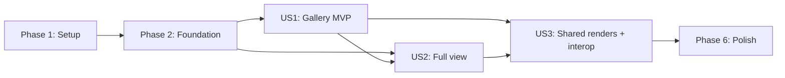

# Tasks: Спільна галерея лендінгів командного простору

**Input**: Design documents from `/specs/004-team-landings-gallery/`

**Prerequisites**: `plan.md`, `spec.md`, `research.md`, `data-model.md`, `contracts/`,
`quickstart.md`, and `.specify/memory/constitution.md`

**Tests**: Required. The repo's quality gate runs `npm test`, and `plan.md` + `quickstart.md`
enumerate the DB/DOM/agent suites for this feature. For each story, write the listed tests
first and confirm they fail for the intended missing behavior before implementing.

**Organization**: Tasks are grouped by user story (US1–US3 from `spec.md`). Shared contract,
the render migration, and the client/agent boundary seams are foundational because every story
depends on them.

## Format: `[ID] [P?] [Story] Description`

- **[P]**: May run in parallel — different files, no dependency on an unfinished task in the
  same batch.
- **[Story]**: Maps the task to User Story 1–3.
- Every task names the exact file(s) it creates or modifies.

## Reuse note (do NOT re-spec)

Per `contracts/reused-surfaces.md`, the catalog listing/search, classifier, single-landing
preview (view-gated), agent preview path + sandbox/CSP/nav-guard, cloud byte serving, sync
tombstones, permissions/realtime, the `LandingPageRenderer` engine, and the local previewer
preset model already exist and are consumed unchanged. Tasks add only the shared-render
persistence and the gallery/full-view surface on top.

---

## Phase 1: Setup (Shared Infrastructure)

**Purpose**: Create the module paths the feature will fill without touching release identity or
deploying anything.

- [x] T001 Scaffold the shared landings-gallery barrel `packages/shared/src/team/landing-gallery.ts` (empty typed exports) and the web feature barrel `apps/web/src/team/landings/index.ts`
- [x] T002 [P] Reserve the client viewer-preset storage key constant `soty.landing-viewer.v1` and the migration filename slot `supabase/migrations/20260810090000_team_landing_renders.sql` (empty forward-only header + matching `ROLLBACK.md` placeholder) in `apps/web/src/team/landings/index.ts` and `supabase/migrations/`

**Checkpoint**: Planned module paths exist; nothing else changed.

---

## Phase 2: Foundational (Blocking Prerequisites)

**Purpose**: Establish the render contract, database authority, and typed client/agent seams
that block every user story.

**⚠️ CRITICAL**: No user-story implementation begins until this phase passes its contract and
database security tests.

### Tests for the foundation

- [x] T003 [P] Write failing shared/SQL parity + guard tests for render states, tile states, viewer presets + `clampZoom`, the render validity predicate (`source_version`+`fingerprint`), opaque `artifactToken`, the `teamWorkspace` tool-contract bump, and analytics forbidden-field guards in `tests/team-landing-contract.test.ts`
- [x] T004 [P] Write failing pgTAP coverage for `landing_renders` (`prosecdef=true`, empty `search_path`, exact EXECUTE ACL, fully-qualified, base-table RLS, view-gated read, service-only writes, foreign/spoofed denial, realtime publication exposes no raw artifact path) in `supabase/tests/database/team-workspace.test.sql`

### Shared contract

- [x] T005 [P] Implement `LandingRenderState`/`LandingRenderFailureReason`/`LandingTileState`, `LandingViewerPreset` + `LandingDevicePreset`/`LandingColorScheme` + shared `clampZoom`, `RenderArtifactRef`, `LandingRenderPointer`, `LandingGalleryQuery`/`Item`/`Page`, and `TeamLandingRenderRequest`/`Result` in `packages/shared/src/team/landing-gallery.ts` and `packages/shared/src/team/transport.ts`
- [x] T006 [P] Add the content-free `team_landing_gallery_view`/`team_landing_open`/`team_landing_render` names + typed props to `packages/shared/src/team/analytics.ts`
- [x] T007 Re-export the landings contract through `packages/shared/src/team/index.ts` and the package root `packages/shared/src/types.ts`
- [x] T008 Register `/api/team/landings/*` under the existing `teamWorkspace` tool contract, bumping only that tool's contract version (not `PRODUCT_VERSION`/`AGENT_API_VERSION`), in `packages/shared/src/release.ts`

### Database authority

- [x] T009 Create `public.landing_renders` (RLS enabled, `revoke all` → narrow grants, `(team_id,material_id,preset)` + partial `ready` indexes, FKs, safe realtime publication) plus `list_landing_renders` (view-caller) and `service_start_landing_render`/`service_commit_landing_render`/`service_fail_landing_render`/`service_mark_landing_renders_stale` as `security definer` `search_path=''` fully-qualified functions with caller-vs-service checks and narrow ACLs, in `supabase/migrations/20260810090000_team_landing_renders.sql`
- [x] T010 Record reverse-order rollback/recovery steps for the render migration in `supabase/migrations/ROLLBACK.md`
- [x] T011 Apply the migration to the isolated development stack and regenerate render/RPC types in `apps/web/src/lib/database.types.ts`

### Boundary seams

- [x] T012 Implement the schema-independent agent client seams — `renderTeamLanding` (reusing the `/api/health` + `toolContractCompatible('teamWorkspace', …)` handshake and `AGENT_UPDATE_REQUIRED`/`PAIRING_REQUIRED` mapping) and `teamLandingEventUrl` — in `apps/web/src/api/client.ts`
- [x] T013 Make the foundation suites pass without weakening assertions in `tests/team-landing-contract.test.ts` and `supabase/tests/database/team-workspace.test.sql`

**Checkpoint**: Shared/SQL contracts agree, `landing_renders` enforces view-read / service-write
with source-identity validity, and web/agent have typed seams but no user workflow yet.

---

## Phase 3: User Story 1 — Переглянути всі лендінги простору як галерею (Priority: P1) 🎯 MVP

**Goal**: Any member with `view` opens a "Landings" surface and sees all landings in the
connected space as a browsable visual gallery, team-isolated, with a welcoming empty state.

**Requirements**: FR-001–FR-003, FR-009, FR-010, FR-014, FR-015, FR-017; SC-001.

**Independent Test**: Seed several confirmed landings + a hidden second team; open the gallery
as a view-only member → see this space's landings as tiles; the hidden team contributes zero
tiles/counts/facets; download/edit affordances are absent.

### Tests for User Story 1

- [x] T014 [P] [US1] Add failing pgTAP cases proving `list_landing_renders` is view-gated, team-isolated, applies the valid-render predicate, and denies foreign-team/spoofed callers in `supabase/tests/database/team-workspace.test.sql`
- [x] T015 [P] [US1] Add a failing DOM journey — gallery lists `category=landing` items, hides another team's landings, shows the empty state with no filters, and hides download/edit for a view-only member — in `tests/team-landing-gallery.test.tsx`

### Implementation for User Story 1

- [x] T016 [US1] After T011 generated types exist, add `listLandingRenders` and `landingRenderImageUrl` (a `category=landing`-scoped `searchCatalog` reuse plus render-pointer fetch) to `apps/web/src/api/team.ts`
- [x] T017 [US1] Implement the `drive-transfer` cached-render serve mode — opaque `artifactToken`, `view` gate, bounded `no-store` Range forwarding of hidden `.soty/landing-previews/…` WebP, `STALE_RENDER`/`NOT_FOUND` on invalid, reusing the US4 media byte path — in `supabase/functions/drive-transfer/handler.ts` and `supabase/functions/drive-transfer/index.ts`
- [x] T018 [US1] Implement `useTeamLandings` layering `useCatalogSearch` (fixed landing facet) + `listLandingRenders` + `useTeamRealtime`, deriving the `LandingTileState` union per data-model §3, in `apps/web/src/team/landings/useTeamLandings.ts`
- [x] T019 [P] [US1] Implement `LandingGalleryTile` — thumbnail from a valid render segment or a state chip (`candidate`/`rendering`/`needs_agent`/`agent_outdated`/`error`), keyboard-operable, gated download/edit — in `apps/web/src/team/landings/LandingGalleryTile.tsx`
- [x] T020 [US1] Implement `LandingGallery` — lazy/paginated tile grid, welcoming empty state (`teamLandingsEmpty`), filters revealed only with content — in `apps/web/src/team/landings/LandingGallery.tsx`
- [x] T021 [US1] Add a `landings` view mode with a labelled entry (reachable in ≤2 actions) alongside `content | search | settings` in `apps/web/src/team/workspace/WorkspaceShell.tsx`
- [x] T022 [US1] Add US1 English/Ukrainian gallery/empty/tile copy and responsive gallery/tile styling in `apps/web/src/i18n.ts` and `apps/web/src/styles.css`
- [x] T023 [US1] Emit the content-free `team_landing_gallery_view` event (opaque attempt id, counts, duration; no names/paths/content) in `apps/web/src/analytics/events.ts` and `apps/web/src/analytics/service.ts`
- [x] T024 [US1] Make the US1 pgTAP and DOM suites pass and record isolation + SC-001 evidence in `supabase/tests/database/team-workspace.test.sql`, `tests/team-landing-gallery.test.tsx`, and `specs/004-team-landings-gallery/quickstart.md`

**Checkpoint**: US1 is a demonstrable MVP — an agent-backed shared gallery — with no dependency
on US2/US3.

---

## Phase 4: User Story 2 — Відкрити лендінг у повному перегляді з галереї (Priority: P2)

**Goal**: From the gallery, open any landing into the existing sandboxed navigable preview +
screenshot fallback, with device/colour-scheme/zoom controls matching the local previewer, and
truthful states for damaged/unsupported landings.

**Requirements**: FR-004, FR-005, FR-011, FR-012; SC-006 (viewing side).

**Independent Test**: Open one rendered landing → navigable sandboxed page (or screenshot
fallback), toggle device/scheme/zoom, then open a corrupt/protected/oversized/unsupported
fixture and confirm a typed state with the gallery still working.

### Tests for User Story 2

- [x] T025 [P] [US2] Add failing DOM tests for open-from-gallery into `MaterialPreview`, device/colour-scheme/zoom controls, blocked external navigation, and typed corrupt/protected/too-large/unsupported states in `tests/team-landing-fullview.test.tsx`

### Implementation for User Story 2

- [x] T026 [P] [US2] Implement `LandingViewerControls` — device/colour-scheme/zoom presets persisted to `soty.landing-viewer.v1`, reusing the shared `LandingViewerPreset` shape — in `apps/web/src/team/landings/LandingViewerControls.tsx`
- [x] T027 [US2] Implement `LandingFullView` opening the existing view-gated single-landing preview path and hosting the viewer controls in `apps/web/src/team/landings/LandingFullView.tsx`
- [x] T028 [US2] Wire tile → full-view open and thread the active preset into the reused preview in `apps/web/src/team/landings/LandingGallery.tsx` and `apps/web/src/team/preview/MaterialPreview.tsx`
- [x] T029 [US2] Add US2 English/Ukrainian full-view/controls/unavailable copy and sandbox/media styling in `apps/web/src/i18n.ts` and `apps/web/src/styles.css`
- [x] T030 [US2] Emit the content-free `team_landing_open` event (tile state, had-agent, duration) in `apps/web/src/analytics/events.ts` and `apps/web/src/analytics/service.ts`
- [x] T031 [US2] Make the US2 DOM suite pass and record evidence in `tests/team-landing-fullview.test.tsx` and `specs/004-team-landings-gallery/quickstart.md`

**Checkpoint**: US2 works against a seeded rendered landing; it composes with US1 and needs no
shared-render persistence yet (an agent-backed render is enough to open one).

---

## Phase 5: User Story 3 — Спільні рендери, стан агента й локальний переглядач (Priority: P3)

**Goal**: Renders are produced once by a paired agent and shared team-wide so agent-less members
browse already-rendered landings; truthful `needs_agent`/`agent_outdated` states; source-change
invalidation; and the connected space opens as a catalog in the standalone local previewer.

**Requirements**: FR-006, FR-007, FR-008, FR-013, FR-016; SC-003, SC-004, SC-007.

**Independent Test**: Member A renders several landings; member B with no running agent browses
them; an un-rendered landing shows `needs_agent` with zero false-ready; replacing a source
invalidates its render within one sync cycle; opening the space in the local previewer shows
identical previews.

### Tests for User Story 3

- [x] T032 [P] [US3] Add failing pgTAP for `service_start/commit/fail/mark_stale` transitions, source-identity-mismatch → `stale` (never `ready`), and service-only ACL in `supabase/tests/database/team-workspace.test.sql`
- [x] T033 [P] [US3] Add a failing agent render contract test — grant → range-download → inspect → extract → `LandingPageRenderer` → segment upload → commit/fail, cancellation, `mkdtemp` cleanup, typed failure reasons, candidate-archive promotion — in `tests/team-landing-render.test.ts`
- [x] T034 [P] [US3] Add failing shared-render + agent-lifecycle tests — agent-less viewing of a `ready` render, `needs_agent`/`agent_outdated` states, zero false-ready, and invalidation on source change — in `tests/team-landing-render-sharing.test.tsx`
- [x] T035 [P] [US3] Add failing `catalog-sync` render invalidation/cleanup coverage (mark stale + delete stale `.soty` artifacts + exclude `.soty` from ingestion) in `tests/catalog-sync.test.ts`

### Implementation for User Story 3

- [x] T036 [US3] Implement the `drive-transfer` scoped artifact-write grant — `view`-gated, scoped to `.soty/landing-previews/<materialId>/<source>-<fp>/<preset>/`, zero side effect on rejection, no Google token/Vault reference to browser or agent — in `supabase/functions/drive-transfer/handler.ts`
- [x] T037 [US3] Implement the agent landing render flow — obtain preview+artifact grants, range-download, inspect, extract to `mkdtemp`, render with the shared `LandingPageRenderer`, upload segments (bounded relay, `part.file.resume()`/`truncated`), `service_commit_landing_render`/`service_fail_landing_render`, cancel/watchdog + `try/finally` cleanup — in `apps/agent/src/team-bridge/landing-gallery.ts`
- [x] T038 [US3] Register `POST /api/team/landings/render` (+ cancel) and the SSE render-progress channel under the `teamWorkspace` `ToolModule` in `apps/agent/src/team-bridge/routes.ts`, `apps/agent/src/team-bridge/events.ts`, and `apps/agent/src/server/tools.ts`
- [x] T039 [US3] Implement `catalog-sync` render invalidation — call `service_mark_landing_renders_stale`, delete stale `.soty/landing-previews/…/<old-source>/` artifacts, and exclude the `.soty` subtree from classification/ingestion — in `supabase/functions/catalog-sync/index.ts`
- [x] T040 [US3] Wire the tile "render" action and live SSE progress through `renderTeamLanding` into `useTeamLandings`, refetching pointers on completion, in `apps/web/src/api/client.ts` and `apps/web/src/team/landings/useTeamLandings.ts`
- [x] T041 [US3] Extend the standalone local previewer to open a connected team space as a catalog source (enumerate the space's landings and render/serve via the team-bridge `/render` flow) in `apps/agent/src/landing-preview/catalog.ts`, `apps/agent/src/landing-preview/scanner.ts`, and `apps/web/src/landing-preview/LandingPreviewPage.tsx`
- [x] T042 [US3] Emit the content-free `team_landing_render` event (outcome, reason, duration) in `apps/web/src/analytics/events.ts` and `apps/web/src/analytics/service.ts`
- [x] T043 [US3] Add US3 English/Ukrainian needs-agent, needs-rerender, and previewer-interop copy plus state styling in `apps/web/src/i18n.ts` and `apps/web/src/styles.css`
- [x] T044 [US3] Make the US3 pgTAP, agent, sync, and DOM suites pass and record SC-003/SC-004/SC-007 evidence in `supabase/tests/database/team-workspace.test.sql`, `tests/team-landing-render.test.ts`, `tests/team-landing-render-sharing.test.tsx`, `tests/catalog-sync.test.ts`, and `specs/004-team-landings-gallery/quickstart.md`

**Checkpoint**: All three stories work independently and compose into shared, agent-optional
landing browsing consistent with the local previewer.

---

## Phase 6: Polish & Cross-Cutting Concerns

**Purpose**: Close security, compatibility, localization, docs, and performance gates without a
production deploy.

- [x] T045 [P] Extend security regression to prove no logs/errors/audit/realtime/analytics leak Google tokens, Vault/grant ids, session URIs, email, filenames/paths/queries/Drive ids/metadata, or landing content, and that the sandbox/CSP/navigation guard hold for both inert thumbnails and full view, in `tests/team-security.test.ts`
- [x] T046 [P] Extend release/handshake/real-agent coverage so the bumped `teamWorkspace` contract includes the new routes, old agents fail only the new routes with `AGENT_UPDATE_REQUIRED`, and existing tools stay compatible, in `tests/release.test.ts` and `scripts/real-agent-check.mjs`
- [x] T047 [P] Extend compile-checked translation-key coverage for all landings copy in `tests/i18n.test.ts`
- [x] T048 [P] Document the hidden `.soty/landing-previews/` render cache, source-identity invalidation, agent-required rendering, and the Drive-write trade-off in `docs/TEAM_WORKSPACE_OPERATIONS.md`
- [x] T049 Add the ≥300-landing first-visible-page benchmark (p95 < 2 s, smooth scroll) and record environment/p50/p95/p99/max in `tests/team-landing-gallery.test.tsx` and `specs/004-team-landings-gallery/quickstart.md`
- [x] T050 Run formatting, lint, unit/integration, shared/web/agent builds, pgTAP, and real-agent gates and record commands/results in `specs/004-team-landings-gallery/quickstart.md`

**Checkpoint**: The feature is reviewable, measurable, documented, and has passed every local
gate without a production migration, deploy, tag, or release.

---

## Dependencies & Execution Order

### Phase dependencies

- **Phase 1 — Setup**: Starts immediately.
- **Phase 2 — Foundation**: Depends on Phase 1 and blocks all user stories.
- **Phase 3 — US1**: Depends on Phase 2; the MVP (agent-backed gallery).
- **Phase 4 — US2**: Depends on Phase 2 for implementation; composes with US1 (opens a tile).
- **Phase 5 — US3**: Depends on Phase 2 and on US1's gallery + US2's viewer to demonstrate
  shared renders and interop; seeded render fixtures keep it independently testable.
- **Phase 6 — Polish**: Depends on the stories in the increment.

### User-story dependency graph



### Schema-bound ordering (cannot be parallelized across an arrow)

- Foundation: T009 migration RPCs → T011 apply/type generation → T016 typed methods.
- US1 web depends on T016; US3 render write depends on T009 service RPCs + T036 grant.

### Within each user story

1. Write the story tests and confirm intended failure.
2. Apply schema/RPC changes before regenerating types.
3. Implement Edge/agent services before the UI that consumes them.
4. Implement core UI before localization/styling/analytics integration.
5. Run the story's independent test and update quickstart evidence.

---

## Parallel Opportunities

### Foundation

`T003` and `T004` (test files) run together; `T005` and `T006` (separate shared files) run
together before `T007`.

### User Story 1

`T014` (pgTAP) and `T015` (DOM) run together. After `T016`/`T018` establish data flow, `T019`
(tile) is `[P]` against `T020` (grid) only until `T020` imports the tile — keep sequential once
composed.

```text
Task T014: pgTAP list_landing_renders in supabase/tests/database/team-workspace.test.sql
Task T015: Gallery DOM journey in tests/team-landing-gallery.test.tsx
```

### User Story 3

`T032`–`T035` are independent test files and run concurrently. After `T036`/`T037`/`T038`
stabilize the render contract, the sync cleanup (`T039`), web wiring (`T040`), and previewer
interop (`T041`) touch separate files.

```text
Task T032: Render RPC transitions in supabase/tests/database/team-workspace.test.sql
Task T033: Agent render contract in tests/team-landing-render.test.ts
Task T034: Shared-render lifecycle in tests/team-landing-render-sharing.test.tsx
Task T035: Sync invalidation in tests/catalog-sync.test.ts
```

### Polish

`T045`–T048 are independent files and run concurrently.

---

## Implementation Strategy

### MVP first: User Story 1

1. Complete Setup + Foundation (contract, migration, seams).
2. Complete US1 Edge serve + web gallery.
3. Stop after T024 and validate a member with `view` browsing an agent-backed shared gallery,
   team-isolated, with an empty state — demoable from isolated development resources.

### Incremental delivery

1. **MVP**: Setup + Foundation + US1 (gallery).
2. **Deep view increment**: US2 (open + viewer controls).
3. **Shared/interop increment**: US3 (persistent shared renders, agent-optional browsing,
   invalidation, local-previewer interop).
4. **Pilot readiness**: security, compatibility, localization, docs, performance.

## Notes

- `[P]` means separate files and no unfinished same-batch dependency; it does not override phase
  prerequisites.
- Treat generated SQL types and the shared contract as one surface; rebuild
  `@video-compressor/shared` before contract SQL/tests.
- Use only isolated local/linked development Supabase and Google **test** resources.
- Do not expose Google tokens/Vault refs to browser or agent, buffer whole render bytes in Edge,
  bypass RLS with a service client on the read path, or serve a stale render as `ready`.
- Preview stays `view`-gated; render artifact writes use the scoped-grant/service path only.
- Commit after each task or coherent group; rerun the relevant failing-first suite.
- This list authorizes implementation artifacts only — no production deploys, migration pushes,
  releases, tags, or destructive Drive operations. Team/space deletion remains a separate
  follow-up (002 known debt), out of scope here.

---

## Phase 7: Convergence

**Purpose**: Close the two implementation gaps found by the post-implementation
spec/plan/tasks-to-code audit before release.

- [x] T051 Add an end-to-end landing-render watchdog that aborts stalled preview/download/upload
      work, reports a typed terminal failure, closes the temporary preview, and emits the shared
      catalog refetch event; cover timeout and cleanup in
      `apps/agent/src/team-bridge/landing-gallery.ts`,
      `supabase/migrations/20260810090000_team_landing_renders.sql`,
      `tests/team-landing-render-bridge.test.ts`, and
      `supabase/tests/database/team-workspace.test.sql`
- [x] T052 Bind the hidden Drive cache hierarchy to the approved source identity
      `.soty/landing-previews/<materialId>/<sourceVersion>-<fingerprint>/<preset>/`, carry the
      validated fingerprint on every segment upload, and prove deterministic reuse in
      `supabase/functions/drive-transfer/handler.ts`,
      `supabase/functions/drive-transfer/index.ts`, `apps/agent/src/team-bridge/landing-gallery.ts`,
      `tests/drive-transfer.test.ts`, and `tests/team-landing-render-bridge.test.ts`

**Checkpoint**: The agent cannot hold a render indefinitely and Drive artifacts are physically
source-bound as well as source-bound by the database validity predicate.
