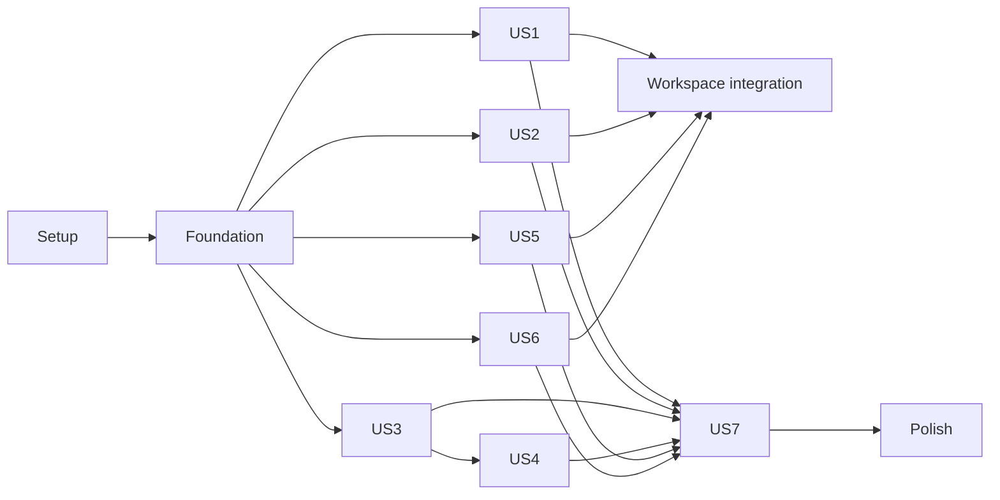

# Tasks: Team Space / Creative Library

**Input**: Design documents from `/specs/005-team-creative-library/`

**Prerequisites**: `plan.md`, `spec.md`, `research.md`, `data-model.md`, `contracts/`,
`quickstart.md`, and `.specify/memory/constitution.md`

**Tests**: Required. Each user story has an independent test and the quickstart defines
automated/security/provider scenarios. Write each listed test first and confirm its intended
failure before implementation.

**Organization**: Tasks are grouped by user story. Shared contracts, schema/security and
typed transport are foundational; tests precede their corresponding implementation.

## Format: `[ID] [P?] [Story] Description`

- **[P]**: May run in parallel after phase prerequisites because it owns different files.
- **[Story]**: Maps to User Story 1–7 in `spec.md`.
- Every task names exact files and completed work is marked `[x]`.

## Phase 1: Setup (Shared Infrastructure)

**Purpose**: Add feature-owned seams without changing release identity or deploying anything.

- [x] T001 Create shared feature barrels in `packages/shared/src/team/creative-library.ts`, `packages/shared/src/team/library-processing.ts`, and `packages/shared/src/team/tasks.ts`
- [x] T002 [P] Scaffold web feature exports in `apps/web/src/team/library/index.ts` and `apps/web/src/team/tasks/index.ts`, plus agent exports in `apps/agent/src/team-bridge/library.ts`
- [x] T003 [P] Register `library-ops` local Edge settings without secrets in `supabase/config.toml` and `supabase/functions/.env.example`
- [x] T004 Add `test:creative-library` with a shared rebuild to root `package.json` without changing product/release versions

**Checkpoint**: Planned module paths, local configuration and targeted test command exist.

---

## Phase 2: Foundational (Blocking Prerequisites)

**Purpose**: Establish canonical types, relational authority, RLS/ACL and typed boundaries.

**⚠️ CRITICAL**: No user-story implementation starts until this phase is green.

### Tests for the foundation

- [x] T005 [P] Add failing unknown-input/state/limit/parity tests for placement, batches, enrichment, jobs/results, task progress/filters/attachments, sharing and contributions in `tests/creative-library-contract.test.ts`
- [x] T006 [P] Add failing pgTAP schema, invariant, RLS, every-function definer/search-path/exact-ACL, null/spoofed/inactive/foreign-team, race and Realtime privacy cases in `supabase/tests/database/creative-library.test.sql`
- [x] T007 [P] Add failing forbidden-payload tests across errors/logs/audit/Realtime/contributions/analytics in `tests/creative-library-security.test.ts`

### Shared contracts

- [x] T008 [P] Implement canonical placement, batch, enrichment, share, normalization and bounds contracts in `packages/shared/src/team/creative-library.ts`
- [x] T009 [P] Implement processing requirement/attempt/result/lease/sidecar state machines and validators in `packages/shared/src/team/library-processing.ts`
- [x] T010 [P] Implement task/status/progress/date-bound/attachment mutation contracts and validators in `packages/shared/src/team/tasks.ts`
- [x] T011 Extend stable team errors, operation payloads, Edge/agent result parsers and safe details in `packages/shared/src/team/transport.ts`
- [x] T012 Re-export all Creative Library contracts from `packages/shared/src/team/index.ts` and `packages/shared/src/types.ts`, and add content-free contribution event types in `packages/shared/src/team/analytics.ts`

### Database authority and typed boundaries

- [x] T013 Create placement/enrichment, upload batch/item, processing requirement/attempt/result, group intent, task/attachment, share preference and contribution tables with constraints/indexes in `supabase/migrations/20260814100000_creative_library_foundation.sql`
- [x] T014 Implement caller/service definer functions, RLS, exact grants, safe Realtime publication and membership-assignee cleanup in `supabase/migrations/20260814101000_creative_library_actions.sql` and `supabase/migrations/20260814102000_creative_library_security.sql`
- [x] T015 Apply migrations only to the isolated local stack and regenerate public types in `apps/web/src/lib/database.types.ts`
- [x] T016 [P] Implement shared structural-folder, source-version, group-intent, contribution and safe provider adapters in `supabase/functions/_shared/library.ts`
- [x] T017 Add schema-bound RPC and schema-independent Edge wrappers with closed response validation in `apps/web/src/api/team.ts`
- [x] T018 [P] Register a dependency-injected Creative Library agent module without new spawn logic in `apps/agent/src/team-bridge/library.ts`, `apps/agent/src/team-bridge/routes.ts`, and `apps/agent/src/server/tools.ts`
- [x] T019 Make foundation contract/pgTAP/security tests pass and document reverse-order migration recovery in `supabase/migrations/ROLLBACK.md`

**Checkpoint**: Shared/SQL types agree; every new row/function is least-privilege; typed clients exist.

---

## Phase 3: User Story 1 — Bulk add and organize materials (Priority: P1) 🎯 MVP

**Goal**: Upload 100+ mixed items with one set of placement/metadata, immediate per-item
visibility, manual-first local language and truthful lightweight enrichment.

**Independent Test**: Complete V2 against an isolated root with partial/resumed items and
confirm one physical/stable material per success without waiting for the whole batch.

### Tests for User Story 1

- [x] T020 [P] [US1] Add failing 100-item start/resume/partial/idempotency/canonical-folder Edge tests in `tests/creative-library-bulk.test.tsx`
- [x] T021 [P] [US1] Add failing bounded landing/video language, manual-race, Unknown and 1-second thumbnail tests in `tests/creative-library-enrichment.test.ts`

### Implementation for User Story 1

- [x] T022 [US1] Implement batch start/item finalize/counter updates, canonical folder ensure and lightweight enqueue routes in `supabase/functions/library-ops/handler.ts` and `supabase/functions/library-ops/index.ts`
- [x] T023 [US1] Implement bounded local landing/video language detection with two video samples and revision-fenced results in `apps/agent/src/team-bridge/language-detection.ts`
- [x] T024 [US1] Implement lightweight image/video thumbnail metadata and exact 1,000 ms video target handling in `apps/agent/src/team-bridge/thumbnail.ts` and `apps/agent/src/team-bridge/library.ts`
- [x] T025 [US1] Implement bounded-concurrency resumable batch upload, per-item progress and partial retry UI in `apps/web/src/team/library/BulkUploadDialog.tsx`
- [x] T026 [US1] Implement paged Finds/Library loading, enrichment state and immediate item insertion in `apps/web/src/team/library/useCreativeLibrary.ts` and `apps/web/src/team/library/CreativeLibrary.tsx`
- [x] T027 [US1] Add English/Ukrainian batch/enrichment copy and responsive progress styles in `apps/web/src/i18n.ts` and `apps/web/src/styles.css`
- [x] T028 [US1] Make US1 tests pass and record actual V2 automated evidence in `specs/005-team-creative-library/quickstart.md`

**Checkpoint**: Bulk upload is independently usable and never auto-starts heavy work.

---

## Phase 4: User Story 2 — Select Finds into the working Library (Priority: P1)

**Goal**: Move one/many stable assets and current sidecars through canonical paths without copies.

**Independent Test**: Complete V3 on My/Shared Drive mocks, including return to Finds and a
forced partial sidecar move.

### Tests for User Story 2

- [x] T029 [P] [US2] Add failing bulk Finds↔Library, structural change, duplicate-folder, live-capability and group-reconciliation tests in `tests/creative-library-placement.test.ts`
- [x] T030 [P] [US2] Add failing selection/card/manual-language/partial-state UI tests in `tests/creative-library-workspace.test.tsx`

### Implementation for User Story 2

- [x] T031 [US2] Implement canonical placement plan/commit, same-team locks and material-group intent service functions in `supabase/migrations/20260814101000_creative_library_actions.sql`
- [x] T032 [US2] Implement live verified structural/group move with compensation and resumable reconciliation in `supabase/functions/library-ops/handler.ts` and `supabase/functions/_shared/library.ts`
- [x] T033 [US2] Implement selectable Library asset cards, bulk Stage actions, structural metadata correction and truthful reconciliation state in `apps/web/src/team/library/LibraryAssetCard.tsx` and `apps/web/src/team/library/CreativeLibrary.tsx`
- [x] T034 [US2] Add Library/Finds views and permissions to `apps/web/src/team/workspace/WorkspaceShell.tsx`
- [x] T035 [US2] Add English/Ukrainian placement/group recovery copy and responsive selection styles in `apps/web/src/i18n.ts` and `apps/web/src/styles.css`
- [x] T036 [US2] Make US2 tests pass and record actual V3 automated evidence in `specs/005-team-creative-library/quickstart.md`

**Checkpoint**: Finds and Library show the same one-per-Drive-file assets in canonical locations.

---

## Phase 5: User Story 3 — Start Process Library at a convenient time (Priority: P2)

**Goal**: Scan missing work without starting it, then produce current shared results and
version-bound transcript sidecars with cached View/Copy/Transcribe actions.

**Independent Test**: Complete V4 and V6 with current/stale/missing results and source
move/trash/restore.

### Tests for User Story 3

- [x] T037 [P] [US3] Add failing deterministic scan, current/stale result, translation-variant and repeated-run tests in `tests/creative-library-processing.test.ts`
- [x] T038 [P] [US3] Add failing transcript artifact uniqueness, cached variant read, no-start View/Copy and grouped move/trash/restore tests in `tests/creative-library-sidecars.test.tsx`
- [x] T039 [P] [US3] Add failing Process Library and video-card action UI tests in `tests/creative-library-processing-ui.test.tsx`

### Implementation for User Story 3

- [x] T040 [US3] Implement paged requirement scan, source-version invalidation, current result/variant queries and first-result acceptance primitives in `supabase/migrations/20260814101000_creative_library_actions.sql`
- [x] T041 [US3] Implement scan/start/finalize/fail routes, deterministic transcript/translation names and result/provenance commit in `supabase/functions/library-ops/handler.ts`
- [x] T042 [US3] Extend the existing team process delegate for requirement identity, transcription/translation output and result finalization in `apps/agent/src/team-bridge/library.ts` and `apps/agent/src/team-bridge/process.ts`
- [x] T043 [US3] Extend source move/trash/restore routing to resolve and converge current sidecars in `supabase/functions/drive-ops/index.ts` and `supabase/functions/_shared/library.ts`
- [x] T044 [US3] Implement Process Library scan/count/confirmation/result UI in `apps/web/src/team/library/ProcessLibraryDialog.tsx` and `apps/web/src/team/library/CreativeLibrary.tsx`
- [x] T045 [US3] Implement current cached Original/translation selection, View/Copy and missing/stale Transcribe actions in `apps/web/src/team/library/VideoTextActions.tsx`
- [x] T046 [US3] Integrate video text and per-asset task/process actions into `apps/web/src/team/library/LibraryAssetCard.tsx` and `apps/web/src/team/catalog/MaterialResults.tsx`
- [x] T047 [US3] Add English/Ukrainian processing/sidecar/cached-text copy and styles in `apps/web/src/i18n.ts` and `apps/web/src/styles.css`
- [x] T048 [US3] Make US3 tests pass and record actual V4/V6 automated evidence in `specs/005-team-creative-library/quickstart.md`

**Checkpoint**: Ready shared results prevent duplicate scans and video text is portable/cached.

---

## Phase 6: User Story 4 — Process Library across several computers (Priority: P2)

**Goal**: Claim different operation-scoped jobs, renew/expire leases and accept only the first valid result.

**Independent Test**: Complete V5 with three agents, forced crash, expiry and finalize race.

### Tests for User Story 4

- [x] T049 [P] [US4] Add failing concurrent claim, heartbeat, expiry/reclaim, pause/cancel and first-result-wins tests in `tests/creative-library-distribution.test.ts`
- [x] T050 [P] [US4] Add failing agent delegation, scoped grants, SSE progress and cleanup tests in `tests/creative-library-agent.test.ts`

### Implementation for User Story 4

- [x] T051 [US4] Implement transactional claim/heartbeat/cancel/expire/skip service functions and lease indexes in `supabase/migrations/20260814101000_creative_library_actions.sql`
- [x] T052 [US4] Implement caller-scoped claim/heartbeat/cancel and service-only candidate acceptance routes in `supabase/functions/library-ops/handler.ts`
- [x] T053 [US4] Implement agent claim delegation, heartbeat renewal, pause/shutdown lease release and first-wins handling in `apps/agent/src/team-bridge/library.ts` and `apps/agent/src/team-bridge/events.ts`
- [x] T054 [US4] Implement compatible-agent state, distributed progress, pause/cancel/skipped reasons and retry UI in `apps/web/src/team/library/ProcessLibraryDialog.tsx`
- [x] T055 [US4] Make US4 tests pass and record actual V5 automated evidence in `specs/005-team-creative-library/quickstart.md`

**Checkpoint**: No stopped device permanently blocks work and no late result overwrites current.

---

## Phase 7: User Story 5 — Work with media in a dedicated task space (Priority: P2)

**Goal**: Create/open tasks from assets or empty state, attach unlimited references by search
or multi-drag, show truthful tiles at the 1-second video frame, edit progress and filter dates.

**Independent Test**: Complete V7 with 100 attachments, duplicate/hidden ids, Drive before/
after comparison, progress edge cases and local date/DST fixtures.

### Tests for User Story 5

- [x] T056 [P] [US5] Add failing task authorization, CRUD, assignee cleanup, progress monotonicity, idempotent attachment and UTC-bound pgTAP cases in `supabase/tests/database/creative-library.test.sql`
- [x] T057 [P] [US5] Add failing shared task/date/attachment parsing and 1-second target tests in `tests/creative-library-contract.test.ts`
- [x] T058 [P] [US5] Add failing create-from-asset, search attach, 100-item multi-drag, duplicate/hidden rejection, tile fallback, progress and calendar UI tests in `tests/creative-library-tasks.test.tsx`

### Implementation for User Story 5

- [x] T059 [US5] Implement task create/list/get/update, assignee cleanup and paged idempotent attach/detach RPCs in `supabase/migrations/20260814101000_creative_library_actions.sql`
- [x] T060 [US5] Add typed task/date/attachment RPC wrappers and decoders in `apps/web/src/api/team.ts`
- [x] T061 [P] [US5] Implement paged task state, local-day UTC bounds, optimistic conflict handling and Realtime refetch in `apps/web/src/team/tasks/useTasks.ts`
- [x] T062 [P] [US5] Implement permission-filtered search and keyboard-accessible left-tree multi-select/drag attachment picker in `apps/web/src/team/tasks/TaskAttachmentPicker.tsx` and `apps/web/src/team/catalog/MaterialBrowser.tsx`
- [x] T063 [P] [US5] Implement image/cached-landing/video attachment tiles with seeked-only 1.0-second readiness and unavailable fallbacks in `apps/web/src/team/tasks/TaskAttachmentTile.tsx`
- [x] T064 [US5] Implement task editor/card, discrete red/green progress, assignee/status controls and paged attachment grid in `apps/web/src/team/tasks/TaskEditor.tsx` and `apps/web/src/team/tasks/TaskCard.tsx`
- [x] T065 [US5] Implement calendar picker plus Today/Yesterday/All Time presets and active state in `apps/web/src/team/tasks/TaskDateFilter.tsx` and `apps/web/src/team/tasks/TaskSpace.tsx`
- [x] T066 [US5] Integrate the dedicated Tasks view and immediate create/open flow in `apps/web/src/team/workspace/WorkspaceShell.tsx`, `apps/web/src/team/library/LibraryAssetCard.tsx`, `apps/web/src/team/catalog/MaterialResults.tsx`, and `apps/web/src/team/landings/LandingGalleryTile.tsx`
- [x] T067 [US5] Add English/Ukrainian task/attachment/date/progress copy and responsive drag/tile styles in `apps/web/src/i18n.ts` and `apps/web/src/styles.css`
- [x] T068 [US5] Make US5 tests pass and record actual V7 automated evidence in `specs/005-team-creative-library/quickstart.md`

**Checkpoint**: Attachments never mutate Drive and task workflows remain lightweight/paged.

---

## Phase 8: User Story 6 — Quickly share the exact Drive link (Priority: P3)

**Goal**: Copy/open the current exact Drive URL, changing Anyone access only on explicit or remembered per-team approval.

**Independent Test**: Complete V8 across public/restricted/capability-lost items and reset preference.

### Tests for User Story 6

- [x] T069 [P] [US6] Add failing public/restricted/status/exact-item/canShare/remember/reset/no-other-mutation tests in `tests/creative-library-sharing.test.ts`
- [x] T070 [P] [US6] Add failing Copy Link/Open in Drive/preference prompt and truthful clipboard UI tests in `tests/creative-library-sharing-ui.test.tsx`

### Implementation for User Story 6

- [x] T071 [US6] Implement caller-only share preference RPCs and exact ACLs in `supabase/migrations/20260814101000_creative_library_actions.sql`
- [x] T072 [US6] Implement live share status, exact `webViewLink`, permission-on-demand and post-verification routes in `supabase/functions/library-ops/handler.ts`
- [x] T073 [US6] Implement Copy Link/Open in Drive/Download actions, remembered prompt and settings reset in `apps/web/src/team/library/LibraryAssetCard.tsx` and `apps/web/src/team/workspace/SpaceSettings.tsx`
- [x] T074 [US6] Add English/Ukrainian share consent/failure copy and styles in `apps/web/src/i18n.ts` and `apps/web/src/styles.css`
- [x] T075 [US6] Make US6 tests pass and record actual V8 automated evidence in `specs/005-team-creative-library/quickstart.md`

**Checkpoint**: Remembered preference skips only the prompt and no unselected item is shared.

---

## Phase 9: User Story 7 — Separate automation and human contribution (Priority: P4)

**Goal**: Record privacy-safe Local Processing and Human Activity separately for future Busy Bees.

**Independent Test**: Complete V9 and prove no combined score or forbidden field exists.

### Tests for User Story 7

- [x] T076 [P] [US7] Add failing category/action/outcome/ACL/privacy/aggregate tests in `tests/creative-library-contributions.test.ts` and `supabase/tests/database/creative-library.test.sql`

### Implementation for User Story 7

- [x] T077 [US7] Implement allowlisted immutable contribution append and owner/admin separate aggregate functions in `supabase/migrations/20260814101000_creative_library_actions.sql`
- [x] T078 [US7] Emit Local Processing outcomes from `supabase/functions/library-ops/handler.ts` and Human Activity from batch/placement/task RPC finalization without content payloads
- [x] T079 [US7] Extend typed analytics/contribution wrappers without a combined score in `apps/web/src/analytics/events.ts`, `apps/web/src/analytics/service.ts`, and `packages/shared/src/team/analytics.ts`
- [x] T080 [US7] Make US7 tests pass and record actual V9 automated evidence in `specs/005-team-creative-library/quickstart.md`

**Checkpoint**: Future achievements can aggregate separate meanings without retroactive privacy repair.

---

## Phase 10: Polish & Cross-Cutting Validation

**Purpose**: Close localization, compatibility, documentation, performance and all local gates.

- [x] T081 [P] Extend recursive English/Ukrainian team-key parity and accessibility coverage in `tests/i18n.test.ts` and `tests/creative-library-workspace.test.tsx`
- [x] T082 [P] Extend release/old-agent compatibility tests for the library bridge without changing version identity in `tests/release.test.ts` and `tests/creative-library-agent.test.ts`
- [x] T083 [P] Add deterministic 10k-library scan and 10k-task/100k-attachment paging benchmarks in `tests/creative-library-benchmark.test.ts`
- [x] T084 Run formatting, lint, contract drift, unit/integration, local pgTAP, shared/web/agent builds and relevant real-agent checks; record exact commands/results in `specs/005-team-creative-library/quickstart.md`
- [x] T085 Execute V1–V9 automated isolated fixtures, verify no production mutation/deploy/release occurred, and record fixture hashes/timings/deviations in `specs/005-team-creative-library/quickstart.md`
- [x] T086 Record the remaining moderated 20-person and live My/Shared Drive/network matrices as explicitly pending until real samples exist in `specs/005-team-creative-library/quickstart.md`

**Checkpoint**: All locally implementable behavior is reviewable and measurable; external evidence is never fabricated.

---

## Phase 11: Clarification Reconciliation (2026-08-15 post-clarify delta)

**Purpose**: Close the drift introduced by the 2026-08-15 clarifications after the original
implementation. Preserves all completed work above; adds only the delta for FR-003a, FR-004a and
the FR-042 sidecar format. No release identity, deploy or destructive Drive action.

- [X] T087 [P] Reconciled the canonical Type set to the shipped six-value classifier `MATERIAL_CATEGORIES` (`video/image/archive/transcript/landing/other`, unclassifiable → `Unknown`): documented the enum + `structural_type` derivation in `specs/005-team-creative-library/data-model.md`, and added a shared↔SQL parity guard (against `team_materials_category_check`) in `tests/creative-library-contract.test.ts`
- [X] T088 Reconcile FR-003a to the shipped case/whitespace-insensitive offer-folder key (`lower(regexp_replace(btrim(value),'\s+',' ','g'))` in `service_reserve_library_folder`/`service_commit_library_folder`) by relaxing the spec in `specs/005-team-creative-library/spec.md` (FR-003a, Clarifications, Assumptions): name variants share one canonical folder with no silent display-value replacement, and truly-distinct offers never collide — so no suffix scheme, migration or `supabase/functions/_shared/library.ts` change is required
- [X] T089 [P] Verified FR-042 sidecar format is already satisfied: `apps/agent/src/team-bridge/process.ts` writes `transcript.txt`/`translation.txt` as UTF-8 `text/plain` with segments joined by `\n` (no timestamps); recorded the evidence in `specs/005-team-creative-library/quickstart.md` (no code change — the sidecars UI test cannot assert agent file format)
- [X] T090 [P] Added the `archive` category glyph in `apps/web/src/team/library/LibraryAssetCard.tsx` so all six Type categories render distinctly; no `apps/web/src/i18n.ts` change needed (the card renders the `initcap` Type value directly) and the offer-disambiguation copy became moot under the FR-003a relaxation
- [X] T091 Ran the reconciliation tests (Node 26 `--no-experimental-webstorage`: contract/sidecars/workspace/placement → 21 passed) and recorded Phase 11 evidence (Type parity, FR-003a relaxation, `.txt` sidecar verification) in `specs/005-team-creative-library/quickstart.md`

**Checkpoint**: Clarified spec, design and code agree on the Type set, offer-collision behavior and sidecar format.

---

## Dependencies & Execution Order

### Phase dependencies

- Phase 1 Setup starts immediately.
- Phase 2 Foundation depends on Setup and blocks every story.
- US1 bulk upload and US2 placement depend on Foundation; US2 integrates US1 results.
- US3 scan/results depends on Foundation and existing Library assets; fixture tests remain independent.
- US4 distributed execution depends on US3 requirement/result primitives.
- US5 tasks depends only on Foundation/catalog for core use; asset-card integration follows US1/US2.
- US6 sharing depends on Foundation and Library cards but has independent provider fixtures.
- US7 contribution events depend on successful story mutations.
- Polish depends on every selected story.
- Phase 11 reconciliation depends on Foundation + US1/US2 (placement/type/offer) and US3
  (transcript sidecars); it changes no release identity and can run after the current build.

### User-story dependency graph

### Within each user story

1. Add failing contract/integration/UI/database tests.
2. Apply schema/function changes before regenerating database types and typed wrappers.
3. Implement Edge/agent authority before UI consumers.
4. Add localization/styles after behavior is stable.
5. Run the independent story test and append truthful quickstart evidence.

Files shared across stories—`apps/web/src/api/team.ts`, `apps/web/src/i18n.ts`,
`apps/web/src/styles.css`, `WorkspaceShell.tsx`, `library-ops/handler.ts`, and the action
migration—must be edited sequentially even when surrounding tasks are marked parallel.

## Parallel Opportunities

- Foundation T005–T007 and T008–T010 own separate test/source files.
- US1 Edge, agent enrichment and initial UI tests can be prepared in parallel after Foundation.
- US3 scan, sidecar and UI failing tests own separate files.
- US5 shared/pgTAP/UI tests and later picker/tile/state components own separate files.
- US6 contract and UI tests can run in parallel.
- Polish localization, compatibility and benchmarks own separate files.

## Implementation Strategy

### MVP first

1. Complete Setup + Foundation.
2. Complete US1 and validate resilient 100-item bulk entry.
3. Complete US2 so Finds→Library reflects understandable Drive structure.
4. Stop only at a story checkpoint if an external fixture is unavailable; do not weaken tests.

### Incremental delivery

1. Bulk entry and placement (US1–US2).
2. Explicit shared processing and transcript lifecycle (US3).
3. Multi-agent acceleration (US4).
4. Dedicated lightweight task space (US5).
5. Exact Drive sharing (US6).
6. Separate contribution foundation and final gates (US7/Polish).

## Notes

- `[P]` means separate files and satisfied dependencies, not permission to race shared files.
- Reuse feature 001/004 authority and previews; do not duplicate tokens, transfer, landing or SSE systems.
- Mark every completed task `[x]`; never mark moderated/provider evidence complete without samples.
- This task list authorizes local implementation artifacts only—no production deploy, release, tag or destructive Drive action.
